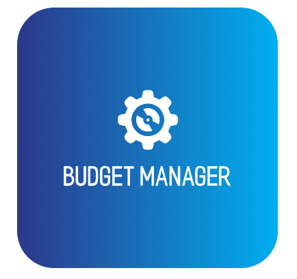
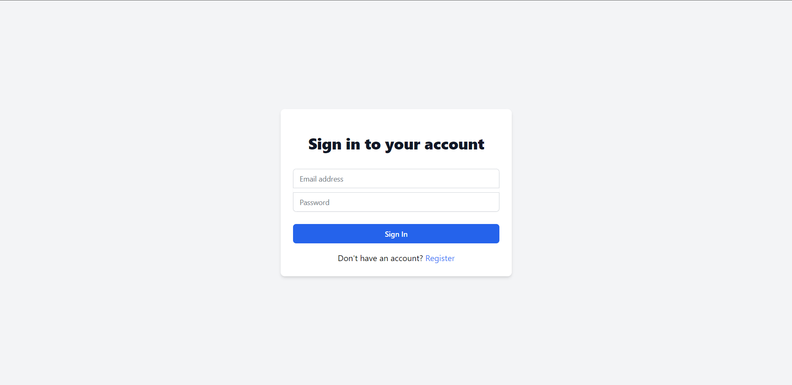
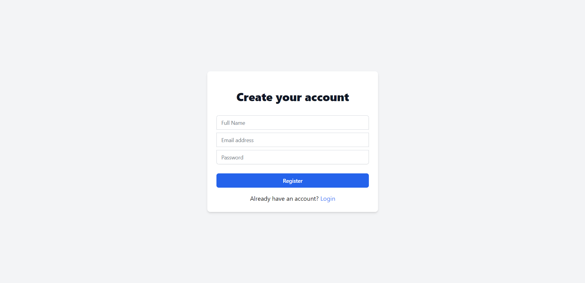
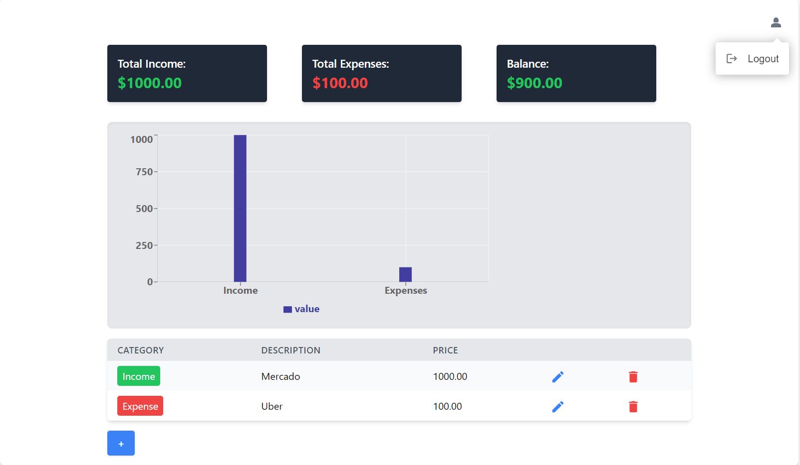
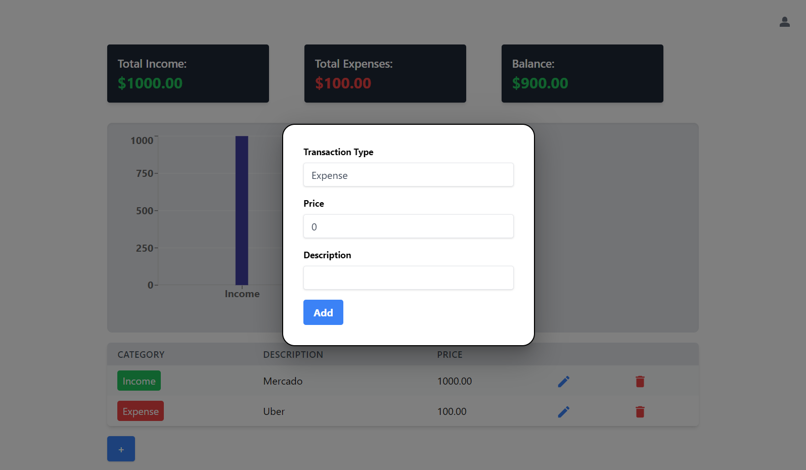
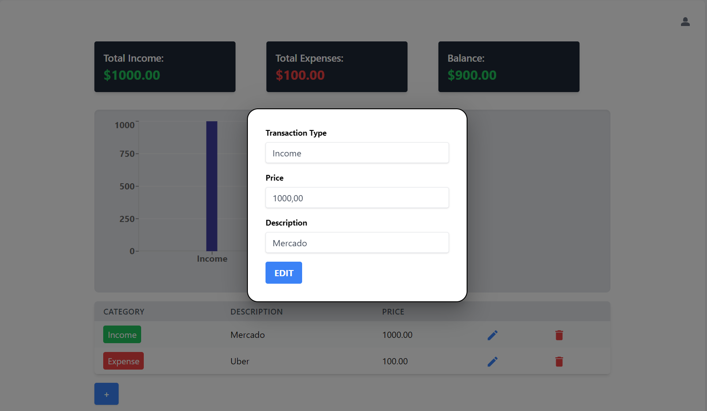
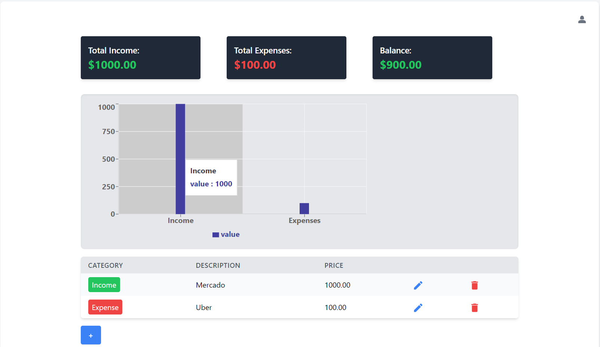

## My Budget App: Personal Finance Management Made Easy

**My Budget App** offers a streamlined experience for users to manage their financial status. Powered by an array of modern technologies and libraries, this application provides an intuitive user interface for monitoring income and expenses.

### Screenshots

*Login Page*

*Register Page*

*Dashboard View with Incomes, Expenses, and Balance*

*Detailed Budget Table with Adding Capabilities*

*Detailed Budget Table with Editing Capabilities*

*Detailed Grafic*

### Tech Stack

- **ViteJs:** Empowering our frontend development, ViteJs offers a no-bundle development experience, significantly speeding up the development process.

- **React:** The core of our user interface. React's component-based architecture helps in building reusable components, making the UI consistent and maintainable.

- **Tailwind:** A utility-first CSS framework. It drastically reduces the time taken to write custom styles and keeps the design consistent across the application.

- **MUI (Material-UI):** For those times we needed ready-to-use components and icons. MUI provides a rich set of components that are also customizable.

- **NodeJs:** Powers our backend services. With its non-blocking I/O operations, NodeJs ensures that our application remains fast and scalable.

- **JWT (JSON Web Tokens):** Provides security for our app. JWT ensures user authentication and authorization processes are secure and seamless.

- **Docker:** Streamlines the process of setting up development environments and ensures the app runs consistently across different platforms.

- **PostgreSQL:** Our choice for relational database management. Known for its extensibility and SQL compliance.

- **ChartJS:** Powers the visual representation of data in the application. It offers flexible and interactive charts, enhancing the user experience.

### Features

1. **User Registration & Login System:** Secure user registration and login functionality, powered by JWT for token-based authentication.

2. **Dashboard Overview:** A snapshot of your finances, showcasing total incomes, expenses, and balance, enhanced with interactive charts.

3. **Budget Table Management:**
   - **Add Entries:** Seamlessly add income or expense items with details.
   - **Edit Rows:** Made a mistake or want to update an entry? Edit with a click.
   - **Remove:** Clear out entries you no longer need with the delete functionality.

4. **Logout System:** Users can securely logout, ensuring that their session data is cleared.

### Development & Contribution

Want to contribute? Great! Fork the repository, create a new branch, make your changes and then submit a pull request. 

#### Getting Started

1. Clone the repository.
2. Install the dependencies using `npm install`.
3. Start the development server using `npm start`.

#### Docker Setup

1. Build the Docker image: `docker build -t my-budget-app .`
2. Run the Docker container: `docker run -p 3000:3000 my-budget-app`

### Conclusion

**My Budget App** offers a powerful tool for those who want to take control of their finances. Its feature-rich environment combined with a user-friendly interface ensures that managing money is no longer a daunting task. Whether you're tech-savvy or new to the digital world, this app is designed for everyone. Dive in and explore a new way to view your finances.